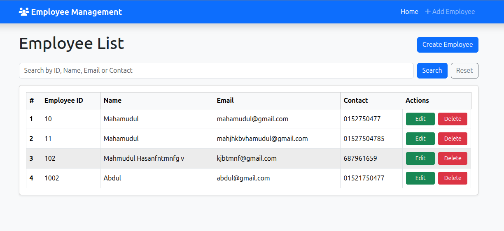
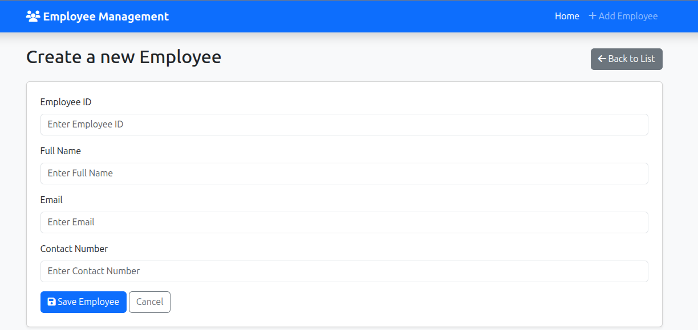
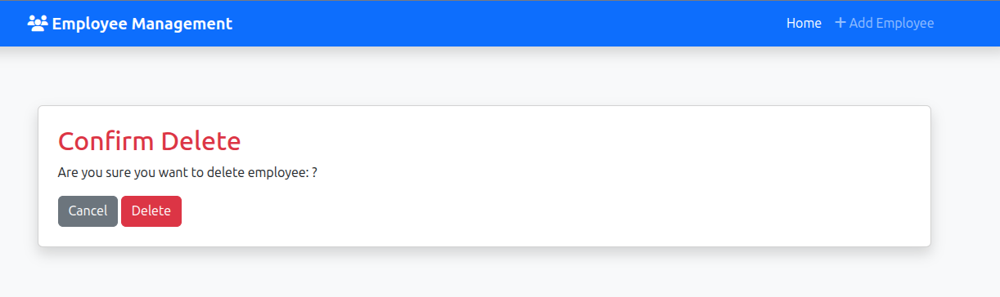

#  Employee Management System (CRUD)

A **Django-based Employee Management System** that allows users to **Create, Read, Update, and Delete (CRUD)** employee records easily.  
This project is designed to demonstrate Django’s core functionalities such as models, forms, templates, and views with full CRUD operations.

---

## Features

###  Core Functionalities
- ➕ **Add New Employee**
- 📋 **View All Employees**
- ✏️ **Edit / Update Employee Information**
- ❌ **Delete Employee Records**
- 🔍 **Search Employees by Name or ID**
- 💾 Data stored securely in **SQLite **

---

## 🧱 Tech Stack

| Category | Technologies Used |
|-----------|-------------------|
| **Backend** | Django (Python) |
| **Frontend** | HTML, CSS, Bootstrap  |
| **Database** | SQLite (default) |
| **Tools** | Django Admin Panel |
| **Deployment** | Render  |

---

👨‍💻 Author

Mahmudul Hasan
Backend Developer | Django & REST API Specialist

Email: mahamudul.ice.pust.12@gmail.com

GitHub: [github.com/yourusername](https://github.com/mahamudul178)

LinkedIn: [linkedin.com/in/yourusername](https://www.linkedin.com/in/md-mahamudul-hasan-04b915262/)